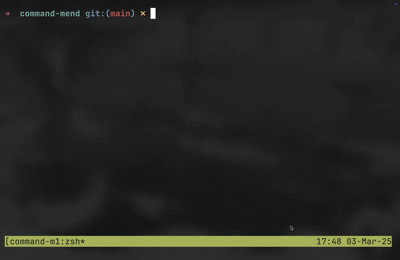

# Command-Mend

A simple utility for editing terminal commands in a tmux popup with Neovim.



## Features

- Edit the current command line in a tmux popup window
- Uses Neovim as the editor
- Customizable keybinding (default: Ctrl+E)

## Requirements

- Zsh
- tmux
- Neovim

## Installation

### Using Homebrew

```bash
brew tap atbender/tools
brew install command-mend
```

Then add to your `.zshrc`:

```
# Use default keybinding (ctrl+e)
source $(brew --prefix command-mend)/bin/command-mend

# Or use a custom keybinding
COMMAND_MEND_KEY='^X' source $(brew --prefix command-mend)/bin/command-mend
```

### Manual Installation

1. Copy the `command-mend` script to a directory in your PATH
2. Add `source /path/to/command-mend` to your `.zshrc`
3. Restart your shell or run `source ~/.zshrc`

## Usage

1. Type a command in your terminal
2. Press ctrl+e (or your custom keybinding)
3. Edit the command in the popup Neovim window
4. Save and exit (`:wq` in Neovim)
5. The edited command will replace what was in your command line

## License

MIT
